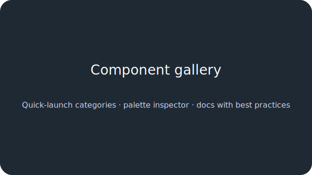

# GPUI Component Workbench

## Why gpui-component?
The workspace assembles a fully themed GPUI shell that exercises reusable widgets, demos, and localization flows in a single place. The workbench and gallery applications show how to wire `gpui-component` primitives together, coordinate global state via the `platform` crate, and document behaviour inline with copy-pastable snippets. With the new launchers and CLI entry points you can script targeted scenarios, record benchmarks, and keep in-app documentation synchronized with the code that powers it.

## Workspace map
- `apps/workbench` – cross-application shell that embeds demos, the gallery preview, and performance dashboards. New CLI options such as `--open demo=data-explorer` open demos directly and the in-app launcher mirrors those shortcuts.
- `apps/gallery` – component gallery with live knobs, palette inspection, and quick-launch controls for categories or keyboard docs. The app now understands `--open` directives for categories, theme variants, icon sets, and locales.
- `apps/demos/*` – individual demo crates (data explorer, markdown notes, code playground, operations dashboard, embedded docs) refactored to expose libraries so the workbench can host them. Each binary simply forwards to its `run()` helper.
- `crates/*` – shared infrastructure: `designsystem` for tokens and icon loaders, `components` for reusable views, `platform` for configuration, command bus, and localization utilities, and `data` for synthetic datasets.
- `xtask` – new workspace utility that provides `cargo xtask demo …`, `cargo xtask gallery …`, and `cargo xtask docs` helpers mirroring `cargo run --example` workflows.
- `docs/` – markdown documentation covering theming tokens, component usage, localization strategy, contribution workflow, performance notes, and generated API docs.

## Build & run
```bash
# launch the workbench with a specific demo
cargo run --bin workbench -- --open demo=data-explorer

# focus the gallery on navigation components in dark mode
cargo run --package gallery -- --open theme=dark --open category=navigation

# convenience wrappers with xtask
cargo xtask demo operations-dashboard          # opens via workbench
cargo xtask demo data-explorer --standalone    # runs the standalone binary
cargo xtask gallery inputs                     # mirrors --open category=inputs
```
The workbench launcher includes buttons for all demos and toggles to open palette previews or theme variants. The gallery quick-launcher keeps CLI shortcuts discoverable inside the UI.

## Feature flags & environment variables
| Flag | Scope | Effect |
| --- | --- | --- |
| `webview` | `apps/demos/webview`, workbench | Enables the embedded documentation demo. Combine with `FEATURE_WEBVIEW=1` to allow runtime webviews. Without the flag the demo publishes a warning notification when launched. |
| `FEATURE_WEBVIEW` | runtime env | Mirrors the existing platform feature flag. Set to `1` to allow the webview demo to open; otherwise the workbench displays an actionable toast instead of spawning the window. |

## API documentation & hosting
Generate comprehensive docs with the new xtask helper:
```bash
cargo xtask docs            # builds target/doc for the entire workspace
```
Publish the rendered docs by copying `target/doc` into the `docs/api` folder (tracked in git) and enabling GitHub Pages for the repository. The README links to `docs/api/index.html`, making the hosted docs available at `https://multiplex55.github.io/GPUI_Learning/` once Pages is configured.

## Screenshots



## Additional documentation
- [Theming tokens](docs/theming.md)
- [Component usage guidelines](docs/components.md)
- [Localization strategy](docs/localization.md)
- [Contribution workflow](docs/contributing.md)
- [Performance notes](docs/performance.md)
- [Accessibility checklist](docs/accessibility.md)

These guides expand on the in-app callouts, list best practices vs. gotchas, and document the new automation commands.
